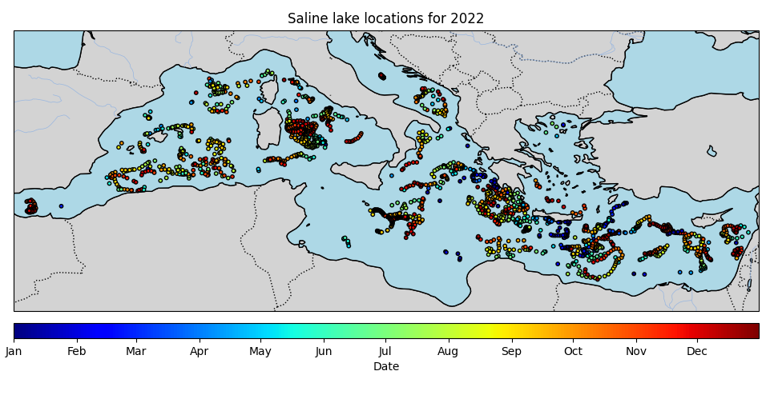
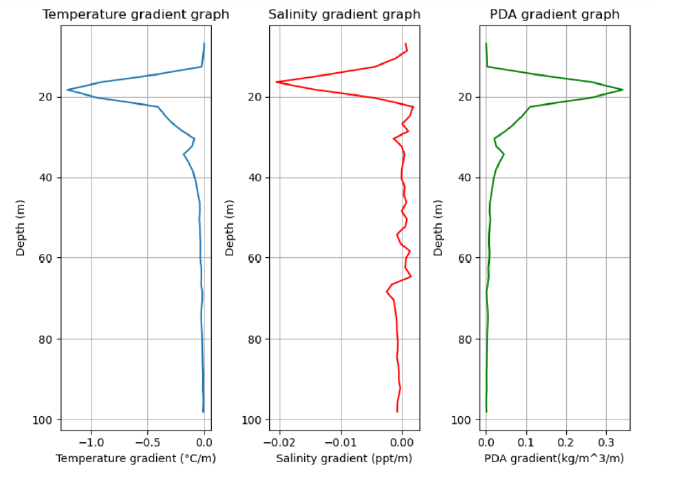
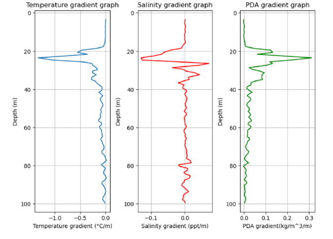

# Surface saline lakes detection

“Surface saline lakes” detection in the Mediterranean Sea using Argo float data

## Context

**Research internship** at Ruđer Bošković Institute in Split, Croatia (April - August 2024)

Division for Marine and Environmental Research

**Supervisors:** Elena Terzić, Ivica Vilibić

## Table of Contents

- [Objective](#objective)
- [Data](#data)
- [Tools](#tools)
- [How to use](#how-to-use)
- [Methods](#methods)
- [Associated Publication](#associated-publication)
- [Acknowledgements](#acknowledgements)
- [Contact](#contact)

## Objective
To document trends, variability, and spatial extent of "Surface Saline Lakes" (SSLs) using Argo profiling float data in the Mediterranean Sea.

SSLs are highly seasonal phenomena characterized by a near-surface salinity maximum overlying the pycnocline. They form in regions of low precipitation, high evaporation, and limited freshwater input, where weak winter wind mixing allows salt to accumulate near the surface.

Originally documented exclusively in the Levantine Basin, SSLs were subsequently observed in the Adriatic Sea following an isolated occurrence in 2017.

## Data
**Source:** [Argo profiling floats](https://argo.ucsd.edu/)

**Region:** Mediterranean Sea  

**Period:** 2000 - July 2024

## Tools
Python libraries: `argopy`, `pandas`, `xarray`, `numpy`, `matplotlib`, `cartopy`, `gsw`, `os`

Python scripts were written in 2024 and may require older versions of the dependencies to run.

## How to use
Run the scripts in the following order:

1. `save_argo_data.py` — Downloads and preprocesses Argo float data for the Mediterranean Sea (including Black sea data). Outputs `Argo_data.csv`.

2. `SSLs_detection.py` — Detects surface saline lakes from the Argo data. Outputs `Save_variables.csv`, `Schmidt_stability_check.csv` and profile figures.

3. `save_SSL_variables_Mediterranean_sea.py` — Filters out Black Sea data. Outputs `SSLs_variables_Mediterranean_sea.csv`.

The final dataset `SSLs_variables_Mediterranean_sea.csv` is available in this repository.

## Methods 

### 1. Argo data preparation ('save_argo_data.py')
Collection and preprocessing of Argo profiling float data in the Mediterranean Sea (including Black sea data) using `argopy`.

TEOS-10 variables are computed for each profile: Potential Density Anomaly (SIG0) and Potential Temperature (PTEMP).

### 2. Surface saline lakes detection and characterization ('SSLs_detection.py')
Detection and documentation of surface saline lakes.
For each Argo float profile, the following gradients are computed:
- **SG** : Salinity gradient (ppt/m)
- **TG** : Temperature gradient (°C/m)
- **PDAG** : Potential Density Anomaly gradient (kg/m³/m)

A profile is flagged as a SSL if the following 3 conditions are met:
- **Condition n°1** : Salinity gradient SG < -0.01 ppt/m
- **Condition n°2** : Salinity gradients above must not exceed 0.02 ppt/m
- **Condition n°3** : Surface salinity must be higher than salinity at the base of the detected SSL

SSLs characterization with the following variables:
- **WMO** : Unique WMO Argo float identifier
- **cycle** : Argo float number cycle
- **SG_min** : Salinity gradient minimum (surface saline lake base)
- **depth_SG_min** : Surface saline lake depth
- **TG_val** :  Temperature gradient value corresponding to depth_SG_min
- **PDAG_val** : Potential density anomaly gradient value corresponding to depth_SG_min
- **lon**, **lat**, **year**, **month**, **day** : Coordinates and datetime values

For each detected SSL, the **Schmidt Stability Index (SSI)** is also computed as a measure of the energy required to homogenize the water column:

$$SSI = g \sum_{z_0}^{z_d} (z - z_g)(\rho(z) - \rho(z_g)) \, dz$$

where :
- $z_d$ : Surface saline lake depth approximation (depth_SG_min + 5)
- $z_0$ : The first measured depth closest to the surface
- $$z_g = \frac{z_d - z_0}{2}$$
- SSI $\geq$ 0

### 3. Surface saline lakes detection and characterization ('save_SSL_variables_Mediterranean_sea.py')
Extracting and collecting SSLs variables from Mediterranean sea (filter out Black sea data).

  
  

## Associated Publication
This work contributed to the following publication:
[Surface saline lakes in the Mediterranean Sea](https://os.copernicus.org/articles/21/1441/2025/os-21-1441-2025.html) — *Ocean Science*, 2025

## Acknowledgements

This work was carried out at the Ruđer Bošković Institute (Split, Croatia) within the Division for Marine and Environmental Research. Many thanks to Elena Terzić and Ivica Vilibić for their guidance and support throughout this internship.

## Contact
Clara Gardiol - clara.gardiol@hotmail.fr

